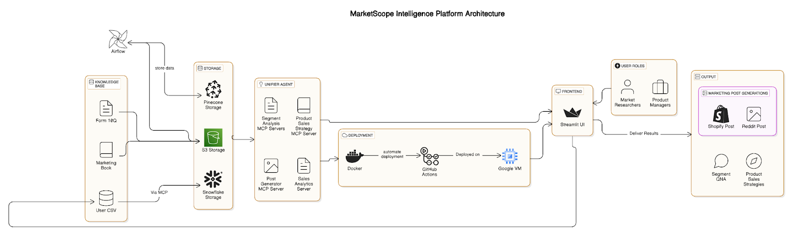

# MarketScope AI: Healthcare Product Analytics 

MarketScope AI is an intelligent analytics platform that helps you understand and analyze different healthcare market segments using advanced AI and natural language processing.

## Features

- **Market Segmentation Analysis** - Analyze and understand different healthcare market segments
- **Strategic Query Optimization** - Get optimized answers to your strategic questions
- **Product Comparison** - Compare products across different segments
- **Sales & Marketing Analysis** - Upload your sales data for AI-powered insights

## Getting Started

### Prerequisites

- Python 3.8 or higher
- Required packages (installed automatically when following the setup instructions)

### Setup and Running


#### Simple Method
Run the simplified starter script:

```bash
python run_servers.py
```

This will:
1. Check for required packages and install them if needed
2. Start the API server
3. Start the Streamlit frontend
4. Provide you with the URL to access the application

#### Manual Setup

1. Install dependencies:
```bash
pip install -r requirements.txt
```

2. Start the API server:
```bash
python api/main.py
```

3. Start the Streamlit frontend:
```bash
streamlit run frontend/app.py
```

## Project Structure

- `api/` - FastAPI backend server
- `frontend/` - Streamlit user interface
- `mcp_servers/` - Model Context Protocol (MCP) servers for different functionalities
- `agents/` - AI agents for analysis
- `config/` - Application configuration

## Healthcare Segments

The platform supports analysis across these healthcare segments:

- Diagnostic Segment
- Supplement Segment
- OTC Pharmaceutical Segment
- Fitness Wearable Segment
- Skin Care Segment

## Data Analysis

To analyze your sales data:

1. Select your segment from the sidebar
2. Go to Sales & Marketing Analysis page
3. Upload your CSV file or use the sample data
4. Click "Analyze Data"

## RAG for Marketing Knowledge

MarketScope includes a Retrieval Augmented Generation (RAG) system that provides access to marketing knowledge from Philip Kotler's Marketing Management book:

1. Go to the Query Optimization page
2. Enter your marketing question
3. The system will retrieve relevant sections from the book
4. Get tailored marketing strategies for your specific segment

## Deployed Links:
-## MCP SERVER:
- unified server - http://34.42.74.104:8000/docs
- marketing analysis server - http://34.42.74.104:8001/docs
- snowflake mcp server - http://34.42.74.104:8004/docs
- sales data analysis server - http://34.42.74.104:8002/docs
- segment mcp server - http://34.42.74.104:8003/docs

## Troubleshooting

If you encounter issues:

- Check that all required dependencies are installed
- Verify that no other applications are using the required ports (8000-8004, 8501)
- Ensure your environment variables are properly set up
- Check the application logs for specific error messages

## CodeLabs
https://codelabs-preview.appspot.com/?file_id=1_936snjPYvoj-RmfO5Vcm2G8xzjVTv0XGRy5wHlFiCo/edit?pli=1&tab=t.0#0

## License

[MIT License](LICENSE)
